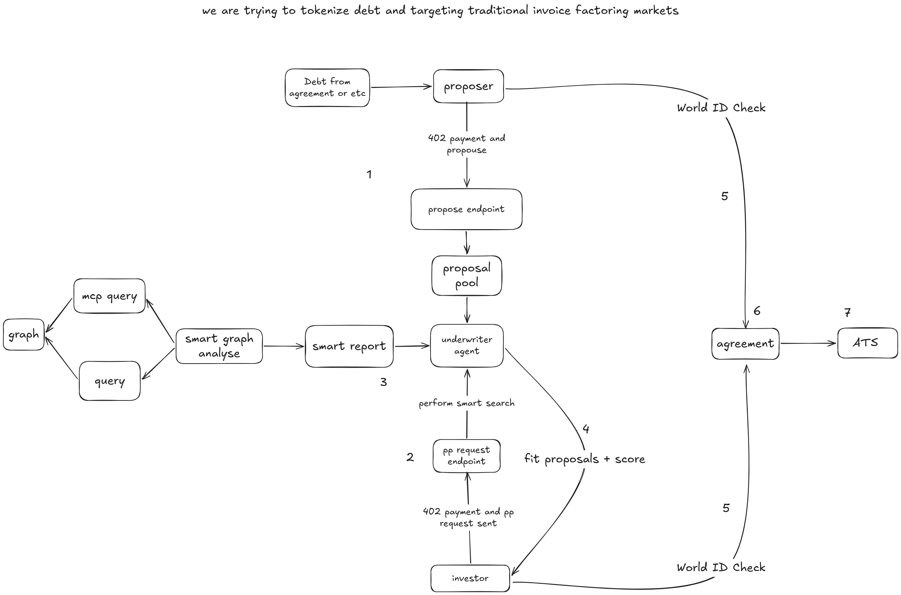

<p align="center">
  
</p>

<p align="center">
  <strong>Autonomous AI Agents for Invoice Financing &amp; Yield Generation</strong>
</p>

> **AI agents autonomously find, evaluate, negotiate, and finance unpaid business invoices.**

Built for **ETHOnline 2026** 🏛️


## 🧩 The Problem

Small and medium businesses sit on **$3+ trillion of unpaid invoices** at any moment (global factoring market). A supplier that has delivered goods and issued an invoice can wait **30–90 days** for payment — cash it needs *today* for payroll, inventory, and growth.

Traditional factoring fixes this, but poorly: it is slow, opaque, relationship-driven, and locked behind institutional intermediaries that cherry-pick large, "safe" invoices. The long tail of business receivables is effectively unfinanceable.

## 💡 The Solution — Factora

Factora turns invoice financing into an **autonomous, agent-to-agent marketplace**:

1. **A business lists an unpaid invoice** as a debt proposal (debt document → economics derived automatically).
2. The **AI Underwriter Agent** reviews the debt document, prices the risk, and sets a **hurdle rate from live DeFi market data** (The Graph).
3. The **Buyer / Investor Agent** evaluates listed proposals, negotiates discount terms, and decides whether to finance.
4. Agents pay each other **per API call with zero API keys or subscriptions** via the **x402 protocol on Hedera** (settled through the Blocky402 facilitator).
5. The financed receivable is **tokenized on-chain** with Hedera's **Asset Tokenization Studio (ATS)** — issuance → compliance → trade → settlement — all verifiable on the Hedera.

No human coordination in the loop: agents find, evaluate, negotiate, and finance — end to end.


## 🤖 The Agents

| Agent | Role |
|-------|------|
| 🧾 **AI Underwriter Agent** | Reviews the debt document with a strict evidence contract (never invents credit scores, payment history, or financials), prices risk, and grounds pricing in **live DeFi hurdle rates** fetched from The Graph. |
| 🤝 **Buyer / Negotiation Agent** | Evaluates listed proposals, negotiates discount terms, and finances receivables. |
| 💸 **Payer Agent (A2A)** | Pays for every paid endpoint machine-to-machine over x402 — no API keys, no subscriptions. Streams every step (invoice → 402 challenge → on-chain settlement) as NDJSON to the UI. |

---

## Diagram
<p align="center">
  
</p>

## Architecture

```
Supplier Agent          Investor Agent
      |                       |
      +---------+-------------+
                |
      Off-chain negotiation (not in this section)
                |
   supplierConfirmation + investorConfirmation
   (same offerId, same price, own account ids)
                |
                v
       assertDealConfirmed()  ← stops here on any mismatch, before Hedera
                |
                v
     ══════════ HEDERA SECTION STARTS HERE ══════════
                |
      HCS: DEAL_CONFIRMED (immutable proof of mutual agreement)
                |
                v
        ATS Bond.create()  → new security for this receivable
                |
                v
   bootstrapSecurityForOperator()
   grants ISSUER_ROLE, KYC_ROLE, CLEARING_VALIDATOR_ROLE,
   SSI_MANAGER_ROLE, ROLE_CLEARING, ROLE_MATURITY_REDEEMER
   + registers operator as SSI credential issuer
   (every new security is its own contract; nothing carries
    over from a prior bond — this runs once per security)
                |
                v
      KYC grant → supplier (real Terminal3 VC, required
      before issuance since internalKyc is active)
                |
                v
        Issue 1 unit → SUPPLIER (initial holder)
                |
                v
   Supplier authorizes operator (authorizeOperator +
   authorizeOperatorByPartition) — one-time per security,
   required before the operator can move the supplier's
   tokens on their behalf during clearing
                |
                v
      KYC grant → investor (real Terminal3 VC)
                |
                v
   Clearing INITIATE (operator-from mode, supplier as source)
                |
                v
   Clearing APPROVE (validator role) → note moves to INVESTOR
                |
                v
   USDC settlement: purchase price, investor → supplier
   (HTS allowance-based transfer; investor never hands
    custody to FACTORED, only pre-approves a ceiling)
                |
                v
   Scheduled Transaction: investor's face-value payout,
   pre-signed now, set to execute automatically at the
   maturity timestamp (see "Scheduled Transactions" below)
                |
                v
      HCS: full audit trail across every step above
                |
                v
     ══════════ (LATER, AT MATURITY) ══════════
                |
   Debtor payment confirmed?
     NO  → cancel the scheduled payout before it fires,
           write DEFAULT_DETECTED to HCS
     YES → deactivate clearing (ROLE_CLEARING; required
           precondition for redemption), then
           Bond.fullRedeemAtMaturity() burns the investor's
           note — the scheduled payout above already paid
           them, or is about to, independent of this step
```


## Scheduled Transactions 

The investor's face-value payout at maturity is a real Hedera **Scheduled Transaction**, not a
cron job hitting a plain transfer. It's created and fully signed at the moment the primary sale
settles — with `waitForExpiry(true)` and `expirationTime` set to the receivable's maturity
timestamp — which means Hedera's own consensus nodes execute the payout automatically, with no
live process required, if the debtor pays on time. If the debtor defaults, the schedule is
cancelled (`ScheduleDeleteTransaction`) before its expiration, using an admin key set at
creation for exactly that purpose. This also produces a complete, timestamped, on-chain audit
trail (HCS + the schedule's own execution record) of exactly when a payment obligation was
created and exactly when — or whether — it was honored.

## Agent integration surface

Agents (supplier-side and investor-side) never touch Hedera directly — this is the entire
contract between the negotiation layer and this section:

```
POST /api/trades/execute
  Body: ApprovedTrade — receivable terms + supplierConfirmation + investorConfirmation
  → 200 SettlementResult (securityId, every transaction id, scheduleId, audit trail)
  → 409 deal confirmations don't match — negotiation bug, not a Hedera issue
  → 424 supplier hasn't authorized the operator on this security yet
  → 503 Hedera execution not enabled / not ready

POST /api/suppliers/:accountId/authorize-operator
  Body: { securityId }
  → one-time per new security

POST /api/investors/:accountId/approve-usdc-allowance
  Body: { amountUsd }
  → one-time (or refreshed) per investor
```

No agent ever constructs an ATS request, signs a Hedera transaction, or knows a role hash
exists. That boundary is deliberate: it's what lets "AI proposes and negotiates, Hedera
executes" hold as a real guarantee rather than a slogan.


## What ATS gave us for free vs. what we built

ATS provides the regulated-security primitives: bond issuance, partition-based clearing,
on-chain KYC enforcement, SSI-based credential verification, and maturity redemption. What
FACTORED's Hedera section adds on top: the deal-confirmation gate before any token exists, the
per-security bootstrap that makes a brand-new bond usable without manual setup, the
non-custodial operator-authorization model for suppliers, the HTS allowance-based cash leg, the
Scheduled Transaction payout mechanism, and the full HCS audit taxonomy tying every step back
to the human-confirmed deal that authorized it.

---

## 🛠️ Tech Stack

| Layer | Tech |
|-------|------|
| Backend | TypeScript (ES2022, Node ≥ 20), Express 5, Zod |
| AI Agents | OpenAI-compatible LLM client (function-calling tool schemas) |
| Live market data | The Graph — Gateway (Messari-standardized subgraphs) + Subgraph MCP (`@modelcontextprotocol/sdk`) |
| Agentic payments | x402 protocol on Hedera (`@x402/core`, `@x402/express`, `@x402/fetch`, `@x402/hedera`) settled via the Blocky402 facilitator |
| On-chain tokenization | Hedera ATS (`@hashgraph/asset-tokenization-sdk`, `@hashgraph/sdk`), HTS tokens, HCS audit |
| Identity | World ID — Selfie Check (medium-assurance biometric credential) |
| Frontend | Vanilla TS/JS + custom CSS |
| Testing | Vitest (unit / component / integration / e2e suites on the sidecar) |

---

## 🚀 Quick Start — Run It Locally

Factora runs as **two services**: the main app (API + frontend) and the ATS execution sidecar.

```bash
# ── ① ATS sidecar (factored-hedera, port 3001) ─────────────────
cd hedera
npm install
PORT=3001 npm run dev          # Fastify execution boundary
# optional one-time on-chain bootstrap:
npm run bootstrap:hedera

# ── ② Main app (repo root, port 3000) — in a second terminal ──
npm install
cp .env.example .env           # then fill in the values below
npm run dev                    # → http://localhost:3000
```

### Environment variables (main app — `.env`)

| Variable | Required | Description |
|----------|----------|-------------|
| `PORT` | — | Main app port (default `3000`) |
| `LOG_LEVEL` | — | `debug` \| `info` \| `warn` \| `error` |
| `LLM_BASE_URL` / `LLM_API_KEY` / `LLM_MODEL` |  | OpenAI-compatible LLM powering the Underwriter Agent |
| `HEDERA_SERVICE_ACCOUNT_ID` |  | Resource-server wallet that **receives** x402 payments |
| `HEDERA_AGENT_ACCOUNT_ID` / `HEDERA_AGENT_PRIVATE_KEY` |  | Payer-agent wallet (must hold testnet HBAR) |
| `X402_NETWORK` | — | `hedera:testnet` (default) \| `hedera:mainnet` |
| `X402_FACILITATOR_URL` | — | Blocky402 facilitator override (auto-derived from network) |
| `PROPOSAL_PRICE_TINYBAR` | — | Price for `POST /api/proposals` (default `100000` = 0.001 HBAR) |
| `SMART_REPORT_*` | — | Per-token metered pricing for the AI smart report |
| `HEDERA_SERVICE_URL` |  | ATS sidecar base URL (`http://localhost:3001`) |
| `GRAPH_API_KEY` |  | The Graph Gateway key ([Subgraph Studio](https://thegraph.com/studio/)) |
| `WORLD_RP_ID` / `WORLD_RP_SIGNING_KEY` |  | World ID relying-party credentials for Selfie Check |

The sidecar keeps its own config in `hedera/.env` (operator account and network settings).

---

## 💸 Paid API Surface (A2A · x402)

| Endpoint | Pricing | Purpose |
|----------|---------|---------|
| `POST /api/proposals` | Fixed (`PROPOSAL_PRICE_TINYBAR`) | Create a debt proposal in the Factora pool |
| `POST /api/buyer/smart-report` | Metered (base + per 1k tokens) | AI Underwriter smart report on a proposal |
| `POST /api/graph/insights` | Fixed | Live on-chain market intelligence (standalone JSON for any agent) |
| `POST /api/agent/paid-request` / `.../stream` | — | The Payer Agent's own A2A proxy — pays through the x402 gate and streams each step (invoice → 402 challenge → on-chain settlement) as NDJSON |

---

##  Tests & Checks

```bash
# Main app
npm run test-graph             # vitest — The Graph feed module
npm run typecheck              # tsc --noEmit
npm run verify                 # live verification against The Graph

# ATS sidecar
cd hedera
npm run test:all-offline       # unit + component suites
npm run test:e2e               # full end-to-end lifecycle
```

---

## 🔮 What's Next

- **Mainnet** — flip `X402_NETWORK=hedera:mainnet` and move operator wallets to production keys.
- **Richer underwriting signals** — payment history, debtor registry checks, and multi-source credit evidence.
- **Secondary market** — trading of tokenized receivables post-issuance.
- **More chains for market data** — expand the Engine A matrix via the shared Messari query pattern (already a one-line config per protocol).
- **Agent SDK** — publish the x402 tool schemas so third-party agents can join the marketplace.

## 👥 Team

**FACTORA Team** — ETHOnline 2026

| Name | Role | Contact |
|------|------|---------|
| emtothed | AI Agent/Backend/Frontend | https://github.com/emtothed |
| ThinkOutSideTheBlock | Hedera/Backend | https://github.com/ThinkOutSideTheBlock |
| 0xDecentralizer | The Graph/Backend | https://github.com/0xDecentralizer |

## 📄 License

ISC
